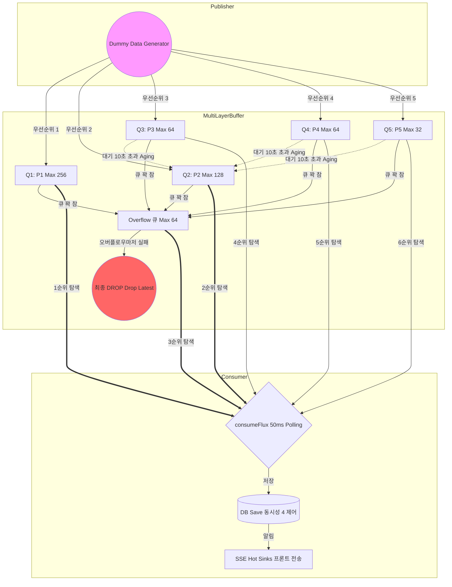
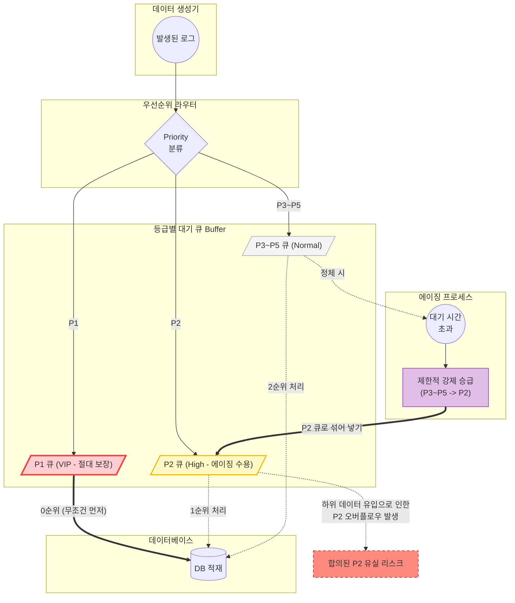

# 🤖 Robot Monitor Dashboard


---

## 1. 💡 개요
- 다수의 로봇으로부터 발생하는 실시간 로그 데이터를 처리하고 실시간으로 시각화하는 모니터링 시스템.
- **Spring WebFlux**를 활용한 **Back Pressure** 제어와 **Server-Sent Events (SSE)** 를 통한 데이터 스트리밍에 초점을 맞추어 제작.

### 📖 설치 및 실행 방법
자세한 설치 단계와 데이터베이스 설정은 [SETUP.md](./SETUP.md) 파일을 참조해 주세요.

### 📁 프로젝트 구조
프로젝트 세부 구조는 [SETUP.md#4-디렉토리-구조](./SETUP.md#4-디렉토리-구조) 섹션에 상세히 기술되어 있습니다.

---

## 2. 🛠️ 기술 스택

### Backend
*   **Framework**: Spring Boot 3.4.1 (WebFlux)
*   **Database**: MySQL 8.0 (R2DBC)
*   **Streaming**: Server-Sent Events (SSE)
*   **Build Tool**: Gradle

### Frontend
*   **Framework**: Next.js 15 (App Router)
*   **UI/Chart**: Tailwind CSS, Recharts
*   **Visuals**: Modern Glassmorphism & Dark Mode Aesthetic

---

## 3. 📊 아키텍처 및 데이터 흐름
전체 시스템은 로봇의 가상 로그 생성부터 사용자의 화면에 출력되기까지 일련의 파이프라인으로 구성된다.



---

## 4. 🚀 주요 기능
Log를 DB에 적재하는 과정에서 발생할 수 있는 병목 현상을 제어하고 안정성을 확보하기 위해 다음의 핵심 기능들이 작동한다.

### 4.1. 🛡️ 우선순위 분리 큐와 효율적인 Back Pressure 제어
- **📁 소스 파일**: [`RobotPriorityQueueBuffer.java`](https://github.com/song-dela-moon/Robot-RT-Monitoring-Dashboard/blob/kangsan/docs/back-pressure-practice/src/main/java/com/example/service/RobotPriorityQueueBuffer.java)

- **우선순위 분리큐 (Generator → DB)**: P1~P5 각각 독립된 버퍼로 관리하며 P1(Critical) 이벤트가 항상 먼저 DB에 저장되도록 보장한다.
- **버퍼바운싱 (Bouncing)**: 특정 주 대기열이 한계에 도달해 포화 상태가 되면, 대기열의 데이터를 임시 큐(Overflow Queue)로 이동시켜 재시도한다.
- **최종 DROP**: 임시 큐마저 모두 가득 차면 서버의 다운을 막기 위해 해당 데이터를 처리하지 않고 완전히 누락(Drop)시킨다.
- **에이징 (Aging)**: 중요도가 낮다는 이유로 우선순위 대결에서 영원히 밀려나는 현상(Starvation)을 방어하기 위해, 임계 시간(10초)을 통과할 정도로 오래 대기한 데이터에게는 상위 큐(예: P3 → P2)로 점프할 수 있는 승격 자격을 부여한다.



```java
// ── 분리큐: 우선순위별 독립 큐 선언 ─────────────────────────────────────────────
    private final ArrayBlockingQueue<PrioritizedEntry> q1 = new ArrayBlockingQueue<>(256); // Critical
    private final ArrayBlockingQueue<PrioritizedEntry> q2 = new ArrayBlockingQueue<>(128); // High (+ aged)
    private final ArrayBlockingQueue<PrioritizedEntry> q3 = new ArrayBlockingQueue<>(64);  // Normal
    private final ArrayBlockingQueue<PrioritizedEntry> q4 = new ArrayBlockingQueue<>(64);  // Low
    private final ArrayBlockingQueue<PrioritizedEntry> q5 = new ArrayBlockingQueue<>(32);  // Idle

// 버퍼바운싱 및 DROP 로직
if (!target.offer(entry)) {
    if (!overflow.offer(entry)) {
         dropCount.incrementAndGet(); // 최종 DROP 발동
    }
}

// 에이징 로직: 대기 임계 시간을 초과한 하위 우선순위 데이터에게 상위 큐 승격(Offer) 기회를 고의로 부여
if (entry.enqueuedAt().isBefore(threshold)) {
    PrioritizedEntry aged = new PrioritizedEntry(entry.log(), 2, entry.enqueuedAt());
    q2.offer(aged); 
}
```

### 4.2. 🧪 가상 트래픽 시뮬레이션 및 테스트 시나리오
- **📁 소스 파일**: [`RobotDummyDataService.java`](https://github.com/song-dela-moon/Robot-RT-Monitoring-Dashboard/blob/kangsan/docs/back-pressure-practice/src/main/java/com/example/service/RobotDummyDataService.java)

시스템이 버틸 수 있는 병목 현상의 한계를 체감하고 테스트하기 위해 로봇의 로그 가치(우선순위)와 데이터 발생량을 파이프라인의 입구에서 동적으로 조작한다. 이 기능은 상태 값을 예약 변경하는 스케줄러 영역과 상태 값을 읽어 데이터를 실제로 찍어내는 공장 영역으로 철저히 분리되어 동작한다.

실시간 생성기 시작 후 아래 시나리오가 자동으로 순서대로 실행되며 방어 로직을 검증한다.

| 구간 | 단계 | 생성 패턴 | 검증 포인트 |
|------|------|-----------|-------------|
| 0s ~ 30s | **NORMAL** | 5개/초, 가우시안 랜덤 CPU | 기준선 — 자연스러운 P1~P5 분포 |
| 30s ~ 60s | **P1_BURST** | 5개/초, CPU 85~100% 강제 | Q1 포화 → overflow 버퍼바운싱 → `FINAL DROP` 로그 확인 |
| 60s ~ 90s | **FLOOD** | 50개/초 (로봇당 10배) | 모든 큐 동시 포화 → `FINAL DROP` 대량 발생 확인 |
| 90s ~ 150s | **STARVATION** | 5개/초, CPU 65~100% (P1/P2만) | Q3/Q4/Q5 기아 → 100s 이후 `AGED P3→P2` 로그 확인 |
| 150s~ | **NORMAL** | 5개/초, 가우시안 랜덤 복귀 | 정상 복구 확인 |

```java
// 1. 상태 변환 스케줄러 (Map에 정의된 타임라인을 순회하며 비동기 알람을 예약)
for (Map.Entry<Long, ScenarioPhase> step : timeline) {
    Mono.delay(Duration.ofSeconds(step.getKey()))
        .subscribe(t -> currentPhase.set(step.getValue()));
}

// 2. 데이터 제너레이터 (1초 단위로 무한 동작하며 읽어온 Phase 상태에 따라 트래픽 양과 로그 긴급도를 밸브처럼 조작)
int perRobot = (phase == ScenarioPhase.FLOOD) ? 10 : 1; 
double cpu = switch (phase) {
    case P1_BURST   -> 85.0 + random.nextDouble() * 15.0; // 무조건 P1 생산 유도
    default         -> Math.random();
};

// 3. priority: CPU 기반 결정 (더미데이터 생성 시 중요도 결정)
        int priority;
        if (cpu >= 85) priority = 1;
        else if (cpu >= 65) priority = 2;
        else if (cpu >= 40) priority = 3;
        else if (cpu >= 20) priority = 4;
        else priority = 5;
```

---

## 5. 📡 실시간 모니터링을 위한 SSE 통신 및 API (기능 세부 구현)
클라이언트가 데이터를 안전하게 전달받고 시각화할 수 있도록 지원하는 브로드캐스트 스트림과 프론트엔드 연동 구현이다.

### 5.1. ⚡ 내부 데이터 스트림과 Zone 1 Back Pressure
- **📁 소스 파일**: [`RobotSseService.java`](https://github.com/song-dela-moon/Robot-RT-Monitoring-Dashboard/blob/kangsan/docs/back-pressure-practice/src/main/java/com/example/service/RobotSseService.java#L47-L50)

버퍼를 무사히 빠져나온 로그 데이터는 R2DBC를 통해 논블로킹 속도로 DB에 저장된다. 저장이 완료되는 즉시, 이벤트 발송 역할을 하는 매니저 시스템을 거쳐 접속된 사용자 채널로 단방향 브로드캐스팅(SSE)된다. 양방향 웹소켓 대신 단방향 스트림인 SSE 방식을 채택하여 서버 연결 부담을 대폭 감소시킨다.

- **Zone 1 Back Pressure**: 클라이언트 측 컴퓨터가 느리거나 네트워크 통신이 안 좋아서 서버가 보내는 속도를 감당하지 못하면 데이터가 서버 쪽에 쌓이게 된다. 이걸 방어하기 위해 SSE 전용 버퍼가 가득 차면 데이터를 폐기한다.

```java
// 특정 로봇 채널에서 클라이언트의 데이터 처리 속도가 느려지면 버퍼에 쌓다가 256개 초과 시 폐기
sink.asFlux().onBackpressureBuffer(256, dropped -> {
    sseDropCount.incrementAndGet();
});
```

### 5.2. 🔌 클라이언트 연동 API 엔드포인트 
- **📁 소스 파일**: [`RobotController.java`](https://github.com/song-dela-moon/Robot-RT-Monitoring-Dashboard/blob/kangsan/docs/back-pressure-practice/src/main/java/com/example/controller/RobotController.java)

클라이언트가 서버의 모니터링 데이터를 원활하게 활용할 수 있도록 세 가지 핵심 REST API 엔드포인트를 노출한다. `RobotController`를 통해 전체 로봇 식별, 과거 데이터 목록 조회 및 실시간 스트림 연결을 지원한다.

| 엔드포인트 패턴 | HTTP 파라미터 | 응답 타입 (Content-Type) | 기능 설명 |
|---|---|---|---|
| `GET /api/robots` | 없음 | `application/json` | 모니터링 가능한 대상 로봇들의 고유 ID 목록을 배열로 반환한다. |
| `GET /api/robots/{robotId}/logs`| `from`, `to` (필수) | `application/json` | 특정 로봇의 주어진 기간(`from`~`to`) 동안의 과거 이력 로그 데이터를 조회한다. |
| `GET /api/robots/{robotId}/stream`| `minPriority` (기본 3) | `text/event-stream` | 특정 로봇의 센서 파이프라인 데이터에 실시간으로 접속(SSE)해 지속적으로 데이터를 구독한다. 지정된 우선순위 이상의 중요한 로그만 수신할 수 있도록 필터링을 지원한다. |

```java
// 실시간 로그 스트리밍 연결 엔드포인트 노출
@GetMapping(value = "/{robotId}/stream", produces = MediaType.TEXT_EVENT_STREAM_VALUE)
public Flux<RobotLogEvent> streamRobotLogs(
        @PathVariable String robotId,
        @RequestParam(defaultValue = "3") int minPriority) {
    // 3순위(Normal) 이상의 중요한 이벤트만 필터링하여 단방향 스트림으로 방출
    return sseService.streamFor(robotId)
            .filter(event -> event.priority() <= minPriority);
}
```

### 5.3. 🖥️ 프론트엔드 대시보드 이벤트 수신 및 윈도우 최적화
- **📁 소스 파일**: [`robot-dashboard/app/page.tsx`](https://github.com/song-dela-moon/Robot-RT-Monitoring-Dashboard/blob/kangsan/docs/robot-dashboard/app/page.tsx)

프론트엔드 환경은 고해상도 모니터링 모드 전용으로 서버 단방향 채널(SSE)을 수립하여 실시간으로 쏟아지는 데이터를 1초 주기로 구독하여 화면 차트를 구성한다. 

- **슬라이딩 윈도우 보존 기법**: 수백 건 이상의 데이터가 실시간으로 쌓이면서 브라우저 메모리에 누수(Leak)가 발생하는 현상을 막기 위해, 수신한 로그 배열의 우측 끝에 최신 데이터를 추가하고 동시에 좌측 끝의 아주 오래된 과거 정보는 잘라내서 버린다(Slice). 즉 당장 필요한 1분간의 한정된 수량(60개) 형태만 끊임없이 무한 보존한다.

```tsx
// SSE 이벤트가 들어올 때 마다 브라우저 RAM을 보호하기 위해 1분 (60개) 분량의 메모리 한계를 유지
const handleSseEvent = useCallback((log: RobotLog) => {
    setRealtimeLogs(prev => {
      const next = [...prev, log];
      return next.slice(-60); // 한계치를 넘은 과거 내역은 배열에서 폐기
    });
}, []);
```
보내주신 두 사진은 프로젝트의 **인프라 구조**와 **배포 자동화 과정**을 아주 명확하게 보여주고 있네요\!

README 맨 하단에 **[6. 🏗️ Infrastructure & CI/CD]** 섹션을 추가하여 구성하는 것을 추천드려요. 아래는 사진의 내용을 분석하여 간략하게 정리한 설명 문구입니다.

-----

## 6\. 🏗️ Infrastructure & CI/CD

프로젝트의 안정적인 운영과 지속적인 통합/배포를 위해 구축한 시스템 구조입니다.

### 6.1. System Architecture

  * **Reverse Proxy**: **Nginx**(Port 8200)를 게이트웨이로 설정하여 보안을 강화하고 트래픽을 제어합니다.
  * **Deployment**: 무중단 배포를 위해 **Blue-Green** 방식을 채택하였으며, Spring Boot와 Next.js가 각각의 컨테이너 환경에서 독립적으로 구동됩니다.
  * **Analysis & DB**: 코드 품질 관리를 위한 **SonarQube**와 실시간 데이터 처리를 위한 **MySQL(R2DBC)** 환경을 구성하였습니다.


### 6.2. CI/CD Pipeline (Jenkins)

  * **Static Analysis**: `gradlew test` 수행 후 **JaCoCo**를 통해 테스트 커버리지를 측정하며, **SonarQube Quality Gate**를 통과해야만 배포가 진행됩니다.
  * **Parallel Build**: 빌드 시간을 최적화하기 위해 **Backend와 Frontend의 Docker 빌드를 병렬(Parallel)로 수행**합니다.
  * **Automation**: `release` 브랜치 Push 시 **Checkout → Analysis → Build → Blue-Green Deploy**까지의 전 과정이 수동 개입 없이 자동으로 완료됩니다.


