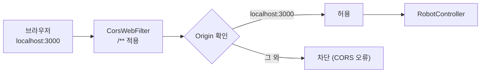
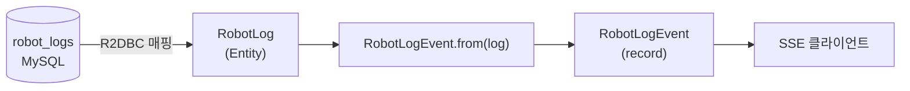
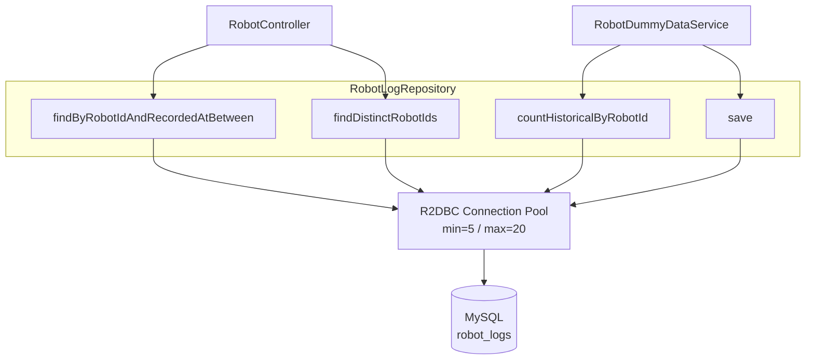
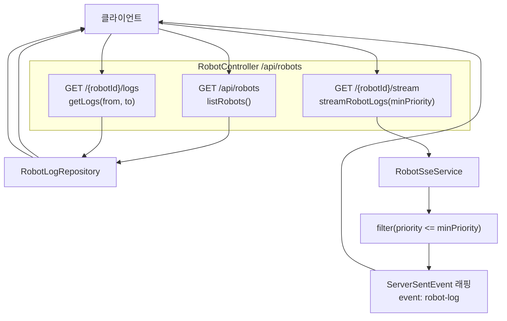
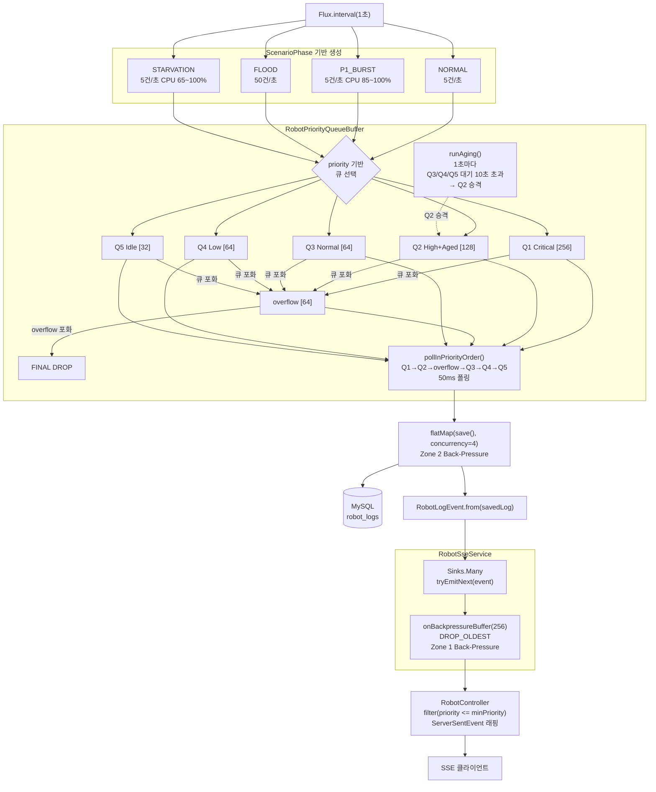
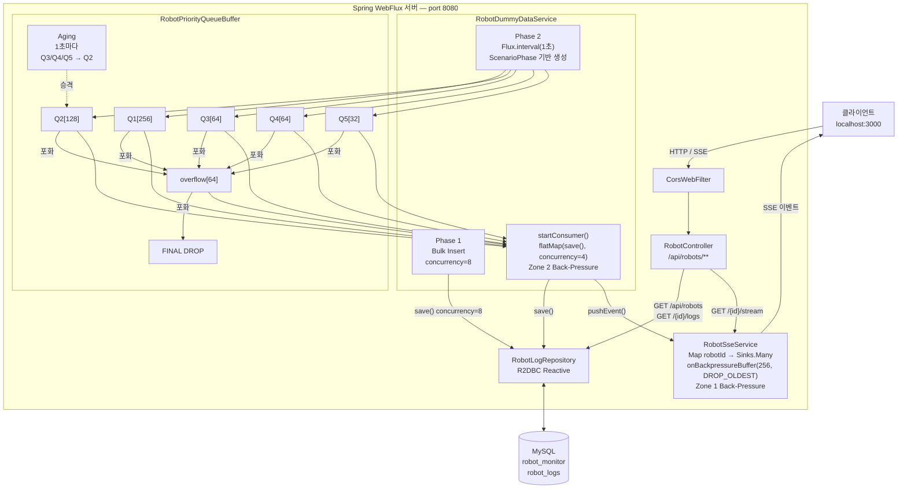

# back-pressure-practice

## 요약

Spring WebFlux + Project Reactor + R2DBC 기반의 실시간 로봇 모니터링 백엔드 실습 프로젝트.
Back-Pressure 개념 학습을 목적으로 설계되었으며, 5개의 가상 로봇 시스템 지표를 실시간으로 생성·저장하고 SSE로 스트리밍한다.

| 항목 | 내용 |
|------|------|
| Java | 17 |
| Spring Boot | 4.0.5 |
| 서버 | Netty (port: 8080) |
| DB | MySQL — `robot_monitor` (R2DBC Pool: min=5, max=20) |
| 빌드 | Gradle |

**학습 핵심 개념**

- Reactive Streams Back-Pressure (2개 구간)
- 우선순위 분리큐 + Aging + 버퍼바운싱
- Hot Publisher (Sinks.Many) 기반 SSE 멀티캐스트
- R2DBC 비동기 DB 접근

---

## 프로젝트 구조

```
back-pressure-practice/
├── build.gradle
├── settings.gradle
└── src/main/
    ├── java/com/example/
    │   ├── WebfluxReactiveStreamsTestApplication.java   # 진입점
    │   ├── config/CorsConfig.java                      # CORS 설정
    │   ├── controller/RobotController.java             # REST + SSE 엔드포인트
    │   ├── dto/RobotLogEvent.java                      # SSE 전송용 DTO
    │   ├── entity/RobotLog.java                        # DB 엔티티
    │   ├── repository/RobotLogRepository.java          # Reactive R2DBC 레포지토리
    │   └── service/
    │       ├── RobotDummyDataService.java              # 더미 데이터 생성 + 시뮬레이터
    │       ├── RobotPriorityQueueBuffer.java           # 우선순위 분리큐 버퍼
    │       └── RobotSseService.java                    # SSE Hot Publisher 관리
    └── resources/
        ├── application.yaml
        ├── schema.sql
        └── data.sql
```

---

## 기본 설정

### application.yaml

```yaml
spring:
  r2dbc:
    url: r2dbc:mysql://localhost:3306/robot_monitor
    pool:
      initial-size: 5
      max-size: 20
  sql:
    init:
      mode: always
      schema-locations: classpath:schema.sql

server:
  port: 8080
```

### CorsConfig

`localhost:3000` (Next.js 개발 서버) 에서의 요청을 허용한다.
모든 HTTP 메서드와 헤더를 허용하며 `/**` 경로에 적용된다.

```java
config.addAllowedOrigin("http://localhost:3000");
config.addAllowedMethod("*");
config.addAllowedHeader("*");
```



---

## config 패키지

| 클래스 | 어노테이션 | 역할 |
|--------|-----------|------|
| `CorsConfig` | `@Configuration` | CorsWebFilter Bean 등록, CORS 정책 설정 |

---

## entity / dto 패키지

### RobotLog (entity)

`robot_logs` 테이블과 1:1 매핑되는 R2DBC 엔티티.
Lombok `@Data`, `@Builder`로 보일러플레이트를 제거하고 `@Table`, `@Column`으로 컬럼을 명시한다.

| 필드 그룹 | 주요 필드 |
|----------|-----------|
| 식별자 | `id`, `robotId` |
| 시스템 지표 | `cpuUsage`, `memUsed`, `memTotal`, `procsRunning`, `procsBlocked` |
| 우선순위 | `priority` (1=Critical ~ 5=Idle) |
| 오도메트리 | `posX`, `posY`, `posZ`, `velLinearX`, `velLinearY`, `velAngularZ` |
| ROS 메타 | `rosFrameId`, `rosTopic`, `recordedAt` |

**우선순위 기준 (CPU 기반)**

| CPU | Priority |
|-----|----------|
| ≥ 85% | 1 Critical |
| 65~85% | 2 High |
| 40~65% | 3 Normal |
| 20~40% | 4 Low |
| < 20% | 5 Idle |

### RobotLogEvent (dto)

SSE 전송 전용 DTO. Java `record`로 불변 객체이며 `from(RobotLog)` 정적 팩토리 메서드로 변환한다.

```java
public static RobotLogEvent from(RobotLog log) { ... }
```

SSE 전송 형식:
```
event: robot-log
id: 1042
data: {"id":1042,"robotId":"robot-001","cpuUsage":87.3,...}
```



---

## repository 패키지

### RobotLogRepository

`ReactiveCrudRepository<RobotLog, Long>` 상속. 모든 반환 타입이 `Flux` / `Mono`로 완전 비동기 동작한다.

| 메서드 | 반환 타입 | 설명 |
|--------|-----------|------|
| `findByRobotIdAndRecordedAtBetween` | `Flux<RobotLog>` | 기간별 로그 조회 (시간 오름차순) |
| `countHistoricalByRobotId` | `Mono<Long>` | 과거 데이터 존재 여부 확인 |
| `findDistinctRobotIds` | `Flux<String>` | 고유 로봇 ID 목록 |
| `save` (상속) | `Mono<RobotLog>` | 저장 또는 업데이트 |

복합 인덱스 `idx_robot_time (robot_id, recorded_at)` 으로 기간 조회 성능을 보장한다.



---

## controller 패키지

### RobotController

`@RestController`, base path `/api/robots`. 3개의 엔드포인트를 제공한다.

| 엔드포인트 | 응답 타입 | 설명 |
|-----------|-----------|------|
| `GET /api/robots` | `application/json` | 로봇 ID 목록 |
| `GET /api/robots/{robotId}/logs?from=&to=` | `application/json` | 기간별 이력 로그 |
| `GET /api/robots/{robotId}/stream?minPriority=` | `text/event-stream` | 실시간 SSE 스트림 |

`minPriority` 기본값은 `3`이며, `priority <= minPriority` 조건으로 필터링한다.



---

## service 패키지

service 패키지는 세 클래스가 협력하여 실시간 데이터 파이프라인을 구성한다.

| 클래스 | 어노테이션 | 핵심 역할 |
|--------|-----------|-----------|
| `RobotDummyDataService` | `@Service` | 더미 데이터 생성, 시나리오 시뮬레이션, Producer/Consumer 조율 |
| `RobotPriorityQueueBuffer` | `@Component` | 우선순위 분리큐, Aging, 버퍼바운싱, DROP |
| `RobotSseService` | `@Service` | 로봇별 Hot Publisher 관리, Zone 1 Back-Pressure |

### RobotDummyDataService

앱 시작 시 `@PostConstruct`로 두 단계를 수행한다.

**Phase 1 — 과거 데이터 Bulk Insert**

각 로봇에 대해 DB에 과거 데이터가 없으면 30일치(43,200건)를 삽입한다.

```java
Flux.range(0, 43200)
    .map(i -> buildRobotLog(robotId, now.minusDays(30).plusMinutes(i)))
    .flatMap(repository::save, 8)  // concurrency=8
```

**Phase 2 — 실시간 생성 (ScenarioPhase 기반)**

| 단계 | 시작 | 생성 패턴 | 학습 목적 |
|------|------|-----------|-----------|
| NORMAL | 0s | 5건/초, 가우시안 CPU | 기준선 |
| P1_BURST | 30s | 5건/초, CPU 85~100% | Q1 포화, DROP 관찰 |
| FLOOD | 60s | 50건/초 (로봇당 10건) | 전체 큐 포화 |
| STARVATION | 90s | 5건/초, CPU 65~100% | 기아, Aging 발동 |
| NORMAL | 150s | 5건/초, 가우시안 CPU | 정상 복귀 |

**Consumer — Zone 2 Back-Pressure**

```java
priorityQueue.consumeFlux()
    .flatMap(log -> repository.save(log), 4)  // concurrency=4
    .map(RobotLogEvent::from)
    .doOnNext(sseService::pushEvent)
```

### RobotPriorityQueueBuffer

P1~P5 독립 큐 + overflow 큐로 구성된 버퍼. 주 큐 포화 시 overflow로 바운싱하고, overflow도 포화 시 FINAL DROP한다.

| 큐 | 용량 | 설명 |
|----|------|------|
| Q1 | 256 | Critical |
| Q2 | 128 | High + Aged |
| Q3 | 64 | Normal |
| Q4 | 64 | Low |
| Q5 | 32 | Idle |
| overflow | 64 | 버퍼바운싱용 임시 큐 |

소비 순서: `Q1 → Q2 → overflow → Q3 → Q4 → Q5` (50ms 폴링)

Aging: Q3/Q4/Q5 항목이 10초 초과 대기 시 Q2로 승격 (1초마다 실행, P1 슬롯 보호)

### RobotSseService

로봇별 `Sinks.Many<RobotLogEvent>` 를 `ConcurrentHashMap`으로 관리한다.

**Zone 1 Back-Pressure**

```java
sink.asFlux()
    .onBackpressureBuffer(256, dropped -> sseDropCount.incrementAndGet())
// 버퍼 초과 시 DROP_OLDEST — 최신 데이터 우선 유지
```

### service 패키지 전체 흐름



---

## 전체 시스템 흐름



---

## API 요약

| 엔드포인트 | 메서드 | Content-Type | 설명 |
|-----------|--------|--------------|------|
| `/api/robots` | GET | application/json | 로봇 ID 목록 |
| `/api/robots/{robotId}/logs` | GET | application/json | 기간별 이력 로그 (`from`, `to` 필수) |
| `/api/robots/{robotId}/stream` | GET | text/event-stream | 실시간 SSE (`minPriority` 기본값 3) |

---
